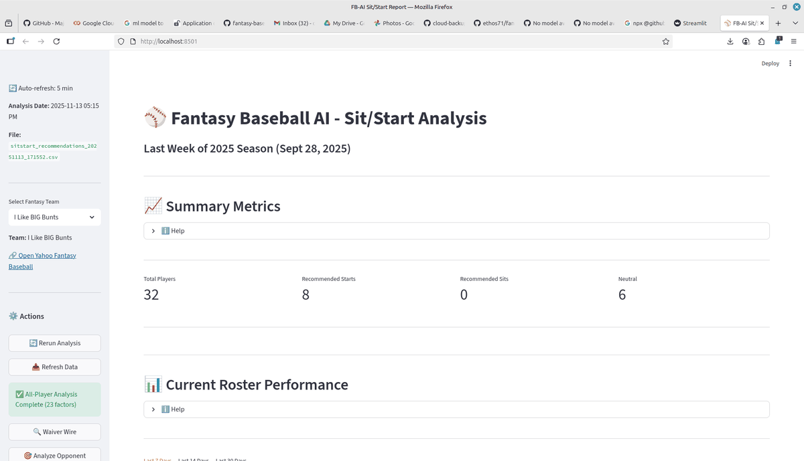

# ⚾ SmartBallz - Quick Start Guide

An automated machine learning system for fantasy baseball optimization that combines MLB statistics, Vegas betting odds, real-time weather data, and Yahoo Fantasy Sports integration to provide data-driven sit/start decisions.

---

## 🎥 Dashboard Demo



*Interactive Streamlit dashboard with real-time sit/start recommendations, waiver wire analysis, and 20+ factor analyses. [See full dashboard documentation →](docs/DASHBOARD_DEMO.md)*

---

## 🚀 The Simplest Way to Get Sit/Start Recommendations

### Step 1: Initial Setup (First Time Only)
```bash
python src/fb_ai.py --refresh
```
Takes ~5-10 minutes. Do this once to download all data.

---

### Step 2: Morning of Game Day

**Check when your games start:**
```bash
smartballz --when
```

This shows you exactly when to run the analysis (30 mins before first game).

---

### Step 3: 30 Minutes Before First Game

**Get sit/start recommendations:**
```bash
smartballz
```

That's it! The system will:
- ✅ **Automatically fetch your latest roster from Yahoo** (both leagues!)
- ✅ Update latest MLB data and weather
- ✅ Run all 20 factor analyses (including Vegas odds!)
- ✅ Tune weights (if before 10 AM) or skip for speed (if after 10 AM)
- ✅ Show you who to start and who to bench

**Too close to game time? Use quick mode:**
```bash
smartballz --quick
```

---

### Step 4: Review & Set Lineup

The analysis will show:

```
🌟 TOP 5 STARTS:
  +1.85  Aaron Judge              ✅ FAVORABLE - START
  +1.72  Shohei Ohtani            ✅ FAVORABLE - START
  +1.68  Mookie Betts             ✅ FAVORABLE - START
  ...

🚫 BOTTOM 5 SITS:
  -1.45  Player Name              ⚠️ UNFAVORABLE - CONSIDER BENCHING
  -1.62  Player Name              🚫 VERY UNFAVORABLE - BENCH
  ...

📊 WAIVER WIRE SUGGESTIONS:
  If a roster player is expected to perform poorly this week,
  better free agent options with favorable matchups will be suggested.
  Example: "Mickey Moniak has home games at Coors Field this week - 
  pickup recommended over current bench player"
```

Apply recommendations to your Yahoo Fantasy lineup!

---

## 📊 Other Useful Commands

```bash
smartballz --last              # View yesterday's recommendations
smartballz --date 2025-09-29   # Run for specific date (postseason)
smartballz --help              # See all options
```

---

## ⏰ Typical Daily Workflow

| Time | Command | What It Does |
|------|---------|-------------|
| **Morning (8-9 AM)** | `smartballz --when` | Check game times |
| **30 mins before games** | `smartballz` | Get recommendations (auto-fetches roster!) |
| **Set lineup** | (Manual) | Apply recommendations in Yahoo |

---

## 🎯 Score Guide

| Score | Recommendation | What To Do |
|-------|----------------|------------|
| +1.5 to +2.0 | 🌟 VERY FAVORABLE | **Definitely start** |
| +0.5 to +1.5 | ✅ FAVORABLE | **Start if available** |
| -0.5 to +0.5 | ⚖️ NEUTRAL | Use your judgment |
| -1.5 to -0.5 | ⚠️ UNFAVORABLE | **Consider benching** |
| -2.0 to -1.5 | 🚫 VERY UNFAVORABLE | **Definitely bench** |

---

## 🔬 20 Factor Analysis System

The system analyzes **20 key factors** using 3+ years of historical data:

### Core Factors (High Impact):
1. **Vegas Odds** (11%) 🆕🔥 - Over/Under totals, implied team run totals, FREE via The Odds API
2. **Historical Matchup** (10%) - Player vs. opponent track record  
3. **Home/Away Venue** (8%) - Location-based performance splits
4. **Injury/Recovery** (8%) - Post-injury performance monitoring

### Strategic Factors (Medium Impact):
5. **Platoon Advantages** (7%) - Left/Right matchup optimization
6. **Bullpen Fatigue** (7%) 🆕 - Weak bullpens = more late-game scoring
7. **Statcast Metrics** (7%) 🆕 - Exit velocity, barrel rate, hard hit %
8. **Wind Analysis** (6%) - Weather conditions impact
9. **Park Factors** (6%) - Ballpark characteristics impact
10. **Recent Form/Streaks** (6%) - Last 7/14/30 day performance 🆕

### Fine-Tuning Factors (Low Impact):
11. **Rest Day Impacts** (4%) - How rest affects performance
12. **Umpire Strike Zone** (3%) - Home plate umpire tendencies
13. **Temperature** (3%) - Temperature effects on ball flight
14. **Pitch Mix** (3%) - Pitcher types vs. batter strengths
15. **Lineup Position** (3%) - Batting order position effects

### Supporting Factors:
16. **Time of Day** (2%) - Day/night game performance
17. **Defensive Positions** (2%) - Team defensive quality
18. **Humidity & Elevation** (2%) - Additional weather factors
19. **Monthly Splits** (1%) - Calendar-based performance trends
20. **Team Momentum** (1%) - Overall team performance trends

**🎯 Automated Weight Tuning:** System optimizes factor weights for each player based on 3+ years of historical backtesting!

---

## 🔄 Automatic Roster Fetching

**Every run automatically pulls your latest roster from Yahoo Fantasy!**
- Fetches both leagues: "I Like BIG Bunts" & "Pure Uncut Adam West"
- Uses current season rosters for the analysis date
- OAuth credentials from: `oauth2.json`
- Historical snapshots saved: `yahoo_fantasy_rosters_YYYYMMDD_HHMMSS.csv`

No need to manually update rosters - it's always current! 🎉

---

## 💡 Pro Tips

- **Run early?** System uses full analysis with weight tuning (more accurate)
- **Run late?** System skips weight tuning for speed (still very good)
- **Force quick mode?** Use `smartballz --quick` (1-2 minutes)
- **Weekly task:** Run `python src/scripts/daily_sitstart.py --tune-only` to refresh weight calibration
- **Waiver wire pickups:** System now suggests better matchup alternatives from free agents!

---

## 🔧 Prerequisites & Setup

### System Dependencies
```bash
sudo apt update && sudo apt install python3 python3-pip python3-xgboost python3-sklearn python3-numpy
```

### Python Packages
```bash
pip install requests pandas xgboost scikit-learn numpy scipy
```

### Yahoo Fantasy Setup

1. Get API credentials from [Yahoo Developer Console](https://developer.yahoo.com/apps/)
2. Create `oauth2.json` in project root with your credentials
3. Set browser path: `echo 'BROWSER_PATH=/usr/bin/google-chrome' > .env`

### Initial Data Download (First Time)

```bash
python src/fb_ai.py --refresh
```

This will:
- Clear any existing data files
- Fetch 4 years of MLB statistics (2022-2025)
- Get current weather for all 30 stadiums
- Fetch your Yahoo Fantasy rosters (auto-updated on every run!)
- Run all 20 factor analyses
- Takes ~5-10 minutes

---

## 📁 Output Files

**sitstart_recommendations_YYYYMMDD_HHMMSS.csv** ⭐ PRIMARY OUTPUT
- Final scores and recommendations
- All 20 factor scores per player
- Individual factor weights
- Waiver wire suggestions for weak performers
- Use this for your lineup decisions!

**streamlit_report.py**
- Interactive dashboard showing weight breakdown
- Top 10 waiver wire prospects
- Factor analysis legend and explanations

---

## 🔧 Advanced Features

### Weight Tuning & Backtesting

The system optimizes factor weights for each player based on historical performance.

**View current weights:**
```bash
python src/scripts/weight_config.py --show                    # Global defaults
python src/scripts/weight_config.py --show --player "Ohtani"  # Player-specific
python src/scripts/weight_config.py --list                    # All custom weights
```

**Manual weight optimization:**
```bash
python src/scripts/backtest_weights.py                       # Backtest entire roster
python src/scripts/backtest_weights.py --optimize --save     # Optimize and save
python src/scripts/backtest_weights.py --player "Ohtani" --optimize --save
```

**Reset weights:**
```bash
python src/scripts/weight_config.py --reset --player "Ohtani"
```

**When to retune:**
- New season starts
- Player changes teams  
- After 20+ games into season
- Player returns from injury

See [docs/WEIGHT_TUNING_GUIDE.md](docs/WEIGHT_TUNING_GUIDE.md) for details.

---

## 🏗️ Project Structure

```
smartballz/
├── data/                              # Generated data files
│   ├── mlb_all_teams.csv              # All 30 MLB teams
│   ├── mlb_YYYY_schedule.csv          # Schedules (4 years)
│   ├── mlb_all_players_*.csv          # Player databases
│   ├── mlb_stadium_weather.csv        # Current weather
│   ├── yahoo_fantasy_rosters_*.csv    # Your rosters (auto-updated!)
│   └── sitstart_recommendations_*.csv # Daily recommendations ⭐
├── src/
│   ├── fb_ai.py                       # Main data manager
│   └── scripts/
│       ├── daily_sitstart.py          # 🎯 Daily workflow (run this!)
│       ├── run_all_fa.py              # Run all factor analyses
│       ├── schedule_helper.py         # Game time scheduler
│       ├── backtest_weights.py        # Weight optimization
│       ├── weight_config.py           # Weight management
│       ├── scrape/                    # Data collection
│       │   ├── mlb_scrape.py          # Full MLB scrape
│       │   ├── mlb_delta_scrape.py    # Quick updates
│       │   ├── weather_scrape.py      # Weather prediction
│       │   ├── weather_delta_scrape.py # Weather updates
│       │   └── yahoo_scrape.py        # Yahoo roster (auto-runs!)
│       └── fa/                        # Factor analyses (20)
│           ├── vegas_odds_fa.py       # 🆕 Vegas betting lines
│           ├── bullpen_fatigue_fa.py  # 🆕 Bullpen strength
│           ├── statcast_fa.py         # 🆕 Advanced metrics
│           ├── recent_form_fa.py      # 🆕 Last 7/14/30 days
│           ├── wind_analysis.py
│           ├── matchup_fa.py
│           ├── home_away_fa.py
│           ├── rest_day_fa.py
│           ├── injury_fa.py
│           ├── umpire_fa.py
│           ├── platoon_fa.py
│           ├── temperature_fa.py
│           ├── pitch_mix_fa.py
│           ├── park_factors_fa.py
│           ├── lineup_position_fa.py
│           ├── time_of_day_fa.py
│           └── defensive_positions_fa.py
├── config/
│   └── player_weights.json            # Tuned weights
├── docs/
│   ├── FACTOR_ANALYSIS_FA.md          # Factor details
│   └── WEIGHT_TUNING_GUIDE.md         # Weight tuning guide
├── streamlit_report.py                # Interactive dashboard
├── .github/prompts/smartballz              # Main smartballz command
└── oauth2.json                        # Yahoo credentials
```

---

## 🔬 Technical Details

**Data Sources:**
- **MLB Stats API** - Official MLB statistics (4 years: 2022-2025)
- **The Odds API** - Vegas betting lines (free tier) 🆕
- **Statcast/Baseball Savant** - Advanced metrics (exit velo, barrel rate) 🆕
- **Open-Meteo API** - Weather forecasting (free, no key required)
- **Yahoo Fantasy API** - Your roster data (OAuth authentication, auto-fetched!)

**Machine Learning:**
- Random Forest classifier for weather prediction
- Differential evolution for weight optimization
- 3+ years historical backtesting

**Analysis:**
- 20 independent factor analyses
- Player-specific weight tuning
- Real-time data integration
- Waiver wire alternative suggestions

For detailed documentation:
- **Factor Analysis:** [docs/FACTOR_ANALYSIS_FA.md](docs/FACTOR_ANALYSIS_FA.md)
- **Weight Tuning:** [docs/WEIGHT_TUNING_GUIDE.md](docs/WEIGHT_TUNING_GUIDE.md)

---

## 🤖 Automation (Optional)

**Setup daily automatic run at 7:00 AM:**
```bash
crontab -e
```

Add this line:
```
0 7 * * * cd /home/dominick/workspace/smartballz && smartballz
```

Recommendations will be ready when you wake up!

---

## 📊 Streamlit Dashboard

**View interactive analysis report:**
```bash
streamlit run streamlit_report.py
```

Shows:
- Weight breakdown for all roster players
- Top 10 waiver wire prospects
- Factor analysis legend
- Historical performance charts

---

## 📚 Resources

- [MLB Stats API Documentation](https://github.com/MajorLeagueBaseball/google-cloud-mlb-hackathon/tree/main/datasets/mlb-statsapi-docs)
- [The Odds API](https://the-odds-api.com/) - Vegas betting lines
- [Baseball Savant / Statcast](https://baseballsavant.mlb.com/) - Advanced metrics
- [Baseball Analytics Research](https://www.mdpi.com/2076-3417/15/13/7081)
- [Open-Meteo Weather API](https://open-meteo.com/)
- [XGBoost Tutorial](https://machinelearningmastery.com/develop-first-xgboost-model-python-scikit-learn/)

---

## 🎯 Quick Command Reference

**Super Simple (Just type this!):**
```bash
smartballz                                  # Run sit/start analysis (auto mode)
smartballz --when                           # Check game times
smartballz --last                           # Show last recommendations
```

**Full Commands:**
```bash
# Initial setup (first time)
python src/fb_ai.py --refresh

# Daily sit/start (auto-fetches roster!)
smartballz                                  # Simple way (recommended)
python src/scripts/daily_sitstart.py  # Full way

# Quick mode (skip weight tuning)
smartballz --quick
python src/scripts/daily_sitstart.py --skip-tune

# Specific date
smartballz --date 2025-09-29

# Check game times (when to run)
smartballz --when
python src/scripts/schedule_helper.py

# Check data status
python src/fb_ai.py --status

# Tune weights only (weekly)
python src/scripts/daily_sitstart.py --tune-only

# View weights
python src/scripts/weight_config.py --list

# Interactive dashboard
streamlit run streamlit_report.py
```

---

## ❓ Need Help?

```bash
smartballz --help                            # Quick help
cat docs/DAILY_WORKFLOW.md              # Detailed workflow guide
```

---

**That's it! Just type `smartballz` 30 minutes before game time and you're done!** 🎉

The system automatically fetches your latest roster from Yahoo every time it runs, so your analysis is always based on your current team!

---

## License

This project uses publicly available MLB data through their official Stats API.
