# Fantasy Baseball AI - System Architecture

## Overview

Fantasy Baseball AI is a comprehensive sit/start recommendation system that analyzes 20+ factors to provide data-driven lineup decisions. The system combines machine learning, statistical analysis, and real-time data from multiple sources.

## High-Level Architecture


## Data Flow Architecture


## Factor Analysis System


## Weight Optimization Process


## XGBoost ML Pipeline

```mermaid
flowchart LR
    subgraph "Feature Engineering"
        FactorScores[Factor Scores<br/>20 features]
        Historical[Historical Performance<br/>7/14/30 day stats]
        Context[Contextual Features<br/>Home/Away, Platoon]
    end
    
    subgraph "Training Data"
        FactorScores --> Features[Feature Matrix]
        Historical --> Features
        Context --> Features
        ActualResults[Actual Game Results] --> Target[Target Variable<br/>Fantasy Points]
    end
    
    subgraph "XGBoost Model"
        Features --> Train[Train XGBoost]
        Target --> Train
        Train --> Model[Trained Model]
    end
    
    subgraph "Prediction"
        NewPlayer[New Player Data] --> Model
        Model --> Prediction[Predicted Points]
    end
    
    Prediction --> Combine[Combine with<br/>Factor Weights]
    Combine --> FinalScore[Final Recommendation]
```

## Daily Analysis Workflow


## Streamlit Dashboard Architecture


## Data Storage Schema


## External API Integration


## Scoring Algorithm

```mermaid
flowchart TD
    Start[Player + Date] --> LoadFactors[Load Factor Scores<br/>20 factors]
    LoadFactors --> LoadWeights[Load Optimized Weights<br/>Player-specific]
    
    LoadWeights --> Multiply[Multiply Each Factor<br/>Score × Weight]
    
    Multiply --> Sum[Sum All Weighted Scores]
    
    Sum --> Normalize[Normalize to -2 to +2 range]
    
    Normalize --> Classify{Classify Score}
    
    Classify -->|>= 0.15| StrongStart[🌟 Strong Start]
    Classify -->|>= 0.05| Favorable[✅ Favorable]
    Classify -->|-0.05 to 0.05| Neutral[⚖️ Neutral]
    Classify -->|>= -0.15| Unfavorable[⚠️ Unfavorable]
    Classify -->|< -0.15| Bench[🚫 Bench]
    
    StrongStart --> Output[Generate Recommendation]
    Favorable --> Output
    Neutral --> Output
    Unfavorable --> Output
    Bench --> Output
```



## Key Technologies

- **Language**: Python 3.12
- **ML Framework**: XGBoost, scikit-learn
- **Dashboard**: Streamlit
- **Data Processing**: pandas, numpy
- **Visualization**: plotly
- **APIs**: Yahoo Fantasy, MLB Stats API
- **Storage**: CSV files (local filesystem)
- **Caching**: Streamlit @st.cache_data
- **Scheduling**: cron / manual execution

## Performance Characteristics

- **Analysis Time**: 30-120 seconds per date
- **Players Analyzed**: ~25-60 per roster
- **Factors Calculated**: 20 per player
- **Historical Data**: Last 3 years (optional)
- **Cache Duration**: Session-based
- **Update Frequency**: Daily (morning)

## System Requirements

- Python 3.12+
- 4GB RAM minimum
- 1GB disk space for historical data
- Internet connection for API access
- Yahoo Fantasy API credentials

## Future Architecture Enhancements

1. **Database Migration**: Move from CSV to PostgreSQL/SQLite
2. **Real-time Updates**: WebSocket integration for live updates
3. **API Layer**: REST API for mobile app integration
4. **Containerization**: Docker for easier deployment
5. **CI/CD**: Automated testing and deployment
6. **Caching Layer**: Redis for improved performance
7. **Message Queue**: Celery for async processing
